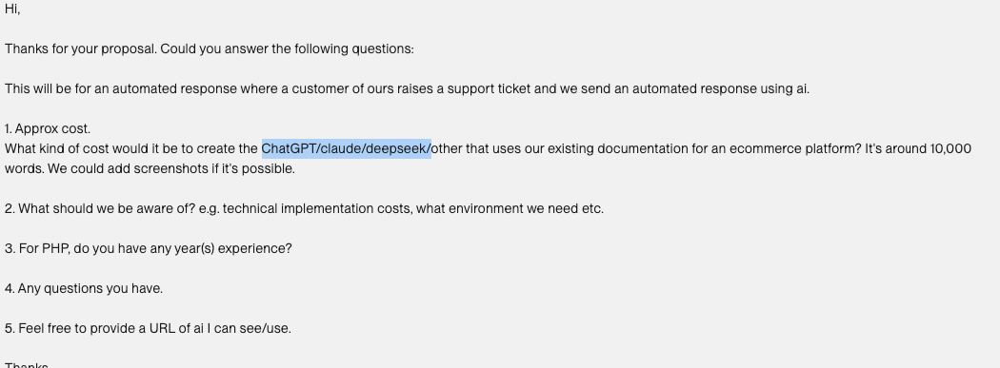

### Documentation AI Augmentation:

1. ChatGPT
2. DeepSeek
3. Claude

### Question:


### Implementation steps:

Step 1:

1. Use LangChain
2. Figure out DB structure and how to store their docs (?)
3. Connector to confluence

Step 2:

1. Memory? LangGraph to handle memory?

### LangGraph
[LangGraph deployment](https://langchain-ai.github.io/langgraphjs/tutorials/deployment/)  


```
$ npx @langchain/langgraph-cli@latest
# Or install globally, will be available as `langgraphjs`
$ npm install -g @langchain/langgraph-cli
```

### JupyterLab

`brew install jupyterlab`

[//]: # (To start jupyterlab now and restart at login:)
[//]: # (brew services start jupyterlab)
[//]: # (Or, if you don't want/need a background service you can just run:)
[//]: # (/opt/homebrew/opt/jupyterlab/bin/jupyter-lab)

### Command used
`open -a intellij\ idea .`  
`rm -rf`  
`nest new .`  
`ga .`  
`gcmsg "chore(nestjs): add basic nestjs configuration"`  
`ls -la`
`gp`  
`git log`   
`git init`  
`gst`  
`nest g resource LangChain`  
`node -v`  
`npm install -g @langchain/langgraph-cli`  
`npm i @langchain/core @langchain/langgraph uuid`
`brew install jupyterlab`  
`brew services start jupyterlab`
`npm i @langchain/core @langchain/langgraph uuid`  
`npm i @langchain/openai`
`npm i @nestjs/config`  
`npm run start:dev`  
`nest g service OpenAI
`
